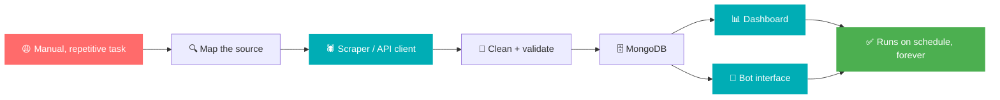

<!--
  ══════════════════════════════════════════════════════════════
   bijay085 / bijay085  ·  Profile README
   Accent: #00ADB5   Dark bg: #020B20   Light bg: #FFFFFF
   Portfolio: https://bijaykoirala0.com.np/
  ══════════════════════════════════════════════════════════════
-->

<!-- ─────────────────────────── HEADER ─────────────────────────── -->

<picture>
  <source media="(prefers-color-scheme: dark)" srcset="https://capsule-render.vercel.app/api?type=waving&color=0:00ADB5,100:020B20&height=180&section=header&text=Bijay%20Koirala&fontSize=48&fontColor=ffffff&animation=fadeIn&fontAlignY=36&desc=Python%20%26%20Automation%20Developer%20%C2%B7%20SEO%20Specialist%20%C2%B7%20Nepal&descAlignY=58&descSize=16">
  
</picture>

<div align="center">


<br>

<a href="https://bijaykoirala0.com.np/"></a>
<a href="mailto:bijaykoirala003@gmail.com"></a>
<a href="https://www.linkedin.com/in/bijay-koirala/"></a>
<a href="https://github.com/bijay085?tab=followers"></a>


<br>


</div>

---

## About

Computer applications student, graduating **2026**. I work in SEO and ecommerce during the day, driving traffic and sales. The rest of the time goes into building automation tools that actually get used, not tools that sit in a repo collecting dust.

Python first: **Requests** and **Selenium** for scraping, **Flask** and **MongoDB** behind the dashboards, **Apps Script** to bridge ClickUp and Google Sheets. Bots run on **Telebot** and **discord.py**, currently serving thousands of users.

The SEO side is not a side note. Knowing how crawlers, structured data, and Search Console actually behave makes me better at scraping, and knowing how to scrape makes me better at SEO audits. Same skill, two directions.

<div align="center">

| Projects | Clients | Response | Status |
|:---:|:---:|:---:|:---:|
| **20+** | **10+** | **< 24h** | **Open for work** |

</div>

<details>
<summary><b>whoami</b></summary>

<br>

```python
class Bijay:
    name     = "Bijay Koirala"
    role     = "Python & Automation Developer · SEO Specialist"
    location = "Nepal 🇳🇵 (GMT+5:45, the 45-minute timezone)"
    status   = "Freelance · available for hire"
    grad     = 2026

    stack = {
        "scraping":  ["Requests", "Selenium", "BeautifulSoup"],
        "backend":   ["Flask", "MongoDB", "REST APIs"],
        "bots":      ["Telebot", "discord.py"],
        "workflow":  ["Google Apps Script", "ClickUp API", "Sheets API"],
        "seo":       ["Search Console", "GA4", "Screaming Frog", "Semrush"],
        "data":      ["Power BI", "Excel", "Google Sheets"],
        "security":  ["Burp Suite", "web pentesting basics"],
    }

    def build(self):
        return [
            "Web scrapers and API tools",
            "Telegram and Discord bots",
            "Workflow connectors (ClickUp, Sheets, APIs)",
            "Scripts that delete repetitive tasks entirely",
        ]

    def ask_me_about(self):
        return "Anti-bot handling, API reverse engineering, technical SEO"
```

</details>

---

## Tech

<div align="center">

**Development**


**SEO, Analytics & Security**


</div>

---

## Experience

```text
Mar 2026 ─ Present   SEO Trainee                     Driving traffic and sales for ecommerce
Dec 2025 ─ Mar 2026  SEO Intern                      Technical audits, GSC, on-page work
    2025 ─ Present   Freelance Developer             Self-employed · 20+ projects, 10+ clients
```

---

## Featured Work

<table>
<tr>
<td width="50%" valign="top">

### 🤖 Bot Ecosystem
[`Repo`](https://github.com/bijay085/Projects/tree/master/Bots)

Telegram and Discord bots running across **thousands of users**. Command routing, role management, scheduled jobs, and user-facing dashboards that people actually navigate without asking for help.

`Telebot` `discord.py` `MongoDB`

</td>
<td width="50%" valign="top">

### 🔄 ClickSync
`Live`

Two-way sync between **ClickUp and Google Sheets** via Apps Script. Edit either side, both stay current. Built because copy-pasting task status into a spreadsheet is not a job for a human.

`Google Apps Script` `ClickUp API` `Sheets API`

</td>
</tr>
<tr>
<td width="50%" valign="top">

### 🛡️ FraudShield
[`Repo`](https://github.com/bijay085/College-Project)

Rule-based transaction monitoring for ecommerce. Scores orders in real time against configurable risk rules and flags anomalies before they ship.

`Python` `Flask` `MongoDB`

</td>
<td width="50%" valign="top">

### 🌐 CMS Platform
[`Live`](https://flamemodparadise.github.io/My-Site/) · [`Repo`](https://github.com/bijay085/Projects/tree/master/CMS%20Site)

Static JSON-based CMS, deployed and running. Admin controls, responsive front end, no framework and no build step.

`HTML` `CSS` `JavaScript` `JSON`

</td>
</tr>
<tr>
<td width="50%" valign="top">

### 🔐 Automation Suite
`Private` · 15+ tools

Scrapers, session handlers, and API clients built to survive rate limits, captchas, and layout changes. Runs unattended on a schedule.

`Python` `Requests` `Selenium` `Proxy rotation`

</td>
<td width="50%" valign="top">

### 🎮 Gamified Learning Tracker
[`Repo`](https://github.com/bijay085/Projects/tree/master/Gamified%20Learning%20Progress%20Tracker)

Progress tracking with XP, streaks, and unlockables. Habit design beats willpower.

`PHP` `MySQL` `JavaScript`

</td>
</tr>
</table>

<div align="center">
<a href="https://bijaykoirala0.com.np/#projects"><b>See the full portfolio →</b></a>
</div>

---

## Services

| Service | What you get | From |
|:---|:---|:---|
| 🕷️ **Web Scraping** | Any site, any scale. Anti-bot handling, proxies, clean structured output. | $15 |
| 🤖 **Bot Development** | Telegram and Discord bots with real UX, not just slash commands. | $15 |
| ⚙️ **Task Automation** | Repetitive workflows turned into scripts that run on a schedule. | $20 |
| 📊 **Data Analysis** | Raw data to Power BI dashboards and scheduled reports. | $100 |
| 🔌 **API & Security** | REST design, third-party integration, security review. | $100 |
| 💬 **Tech Help** | Hourly consulting, debugging, architecture calls. | $50/hr |

> [!NOTE]
> Available for hire. Email **bijaykoirala003@gmail.com** or reach me through [bijaykoirala0.com.np](https://bijaykoirala0.com.np/#contact). Reply within 24 hours, Nepal time (GMT+5:45).

---

## How the Work Flows



---

## Stats

<div align="center">

<picture>
  <source media="(prefers-color-scheme: dark)" srcset="https://github-readme-stats.vercel.app/api?username=bijay085&show_icons=true&count_private=true&hide_border=true&title_color=00ADB5&icon_color=00ADB5&text_color=c9d1d9&bg_color=020B20">
  
</picture>
<picture>
  <source media="(prefers-color-scheme: dark)" srcset="https://github-readme-stats.vercel.app/api/top-langs/?username=bijay085&layout=compact&hide_border=true&langs_count=8&title_color=00ADB5&text_color=c9d1d9&bg_color=020B20">
  
</picture>

<br><br>

<picture>
  <source media="(prefers-color-scheme: dark)" srcset="https://streak-stats.demolab.com?user=bijay085&theme=transparent&hide_border=true&stroke=00ADB5&ring=00ADB5&fire=FF6B6B&currStreakLabel=00ADB5&sideLabels=c9d1d9&dates=8b949e&sideNums=c9d1d9&currStreakNum=c9d1d9">
  
</picture>

<br><br>


<br>

<picture>
  <source media="(prefers-color-scheme: dark)" srcset="https://github-readme-activity-graph.vercel.app/graph?username=bijay085&bg_color=020B20&color=00ADB5&line=00ADB5&point=ffffff&area_color=020B20&title_color=ffffff&area=true&hide_border=true">
  
</picture>

</div>

<details>
<summary><b>More stats</b></summary>

<br>
<div align="center">


</div>

</details>

<div align="center">

<picture>
  <source media="(prefers-color-scheme: dark)" srcset="https://raw.githubusercontent.com/platane/platane/output/github-contribution-grid-snake-dark.svg">
  
</picture>

</div>

---

## Roadmap

```text
  [x]  Ship 20+ freelance projects, 10+ clients
  [x]  Bot ecosystem live across thousands of users
  [x]  Land an SEO role while still studying
  [ ]  Graduate: computer applications, 2026              ▓▓▓▓▓▓▓▓░░  80%
  [ ]  Machine learning: from using APIs to training       ▓▓▓▓▓░░░░░  50%
  [ ]  Dockerize and cloud-deploy every private tool       ▓▓▓░░░░░░░  30%
  [ ]  Open source 3 of the private automation tools       ▓▓░░░░░░░░  20%
  [ ]  Public live-data analytics dashboard, no login      ▓░░░░░░░░░  10%
```

---

## Off the Clock

| | |
|:---|:---|
| 🎮 | Gaming. Fighting games mostly. I lose with technique. |
| 🎬 | Anime, and I will defend the filler episodes. |
| 🕵️ | Web pentesting. Burp Suite is a hobby, not just a work tool. |
| 📈 | Ecommerce and SEO experiments on my own sites. |
| 😴 | Sleeping is a hobby, not a necessity. 48h/day if physics allowed. |

---

## Connect

<div align="center">

<a href="https://bijaykoirala0.com.np/"></a>
<a href="mailto:bijaykoirala003@gmail.com"></a>
<a href="https://www.linkedin.com/in/bijay-koirala/"></a>
<a href="https://github.com/bijay085"></a>

<br><br>

<i>"First, solve the problem. Then, write the code."</i><br>
<sub>John Johnson</sub>

</div>

<picture>
  <source media="(prefers-color-scheme: dark)" srcset="https://capsule-render.vercel.app/api?type=waving&color=0:020B20,100:00ADB5&height=110&section=footer">
  
</picture>
